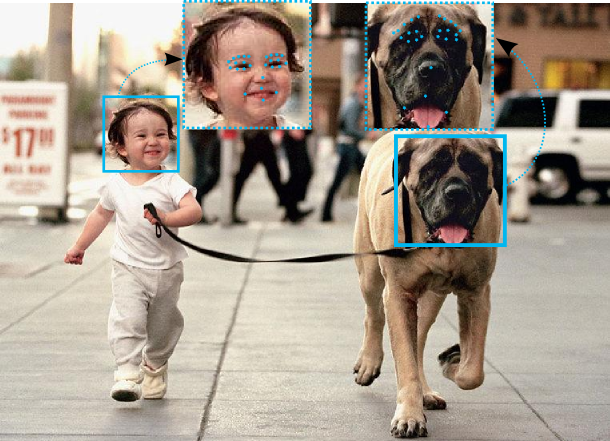

# 2StepsLearning
[[Project Page]](https://www.verlab.dcc.ufmg.br/portfolio-item/detecting-landmarks-on-faces-in-different-domains/)     [[Paper]](https://www.verlab.dcc.ufmg.br/fradeicip2018/) 

This Project aims to investigate approaches for landmarks detection in different domains face using a small dataset labeled. Detecting landmarks embedded with semantic information from images is one of the key challenges in image processing and computer vision fields. In general, landmarks or fiducial points are related to discriminative locations in the image, frequently embedding some meaning. For example, in human or animal faces, a landmark locates regions comprising the eyes, eyebrows, mouth, and the tip of the nose. After all, the automatic estimation of landmarks on faces has a myriad of applications such as faces recognition, game animation, avatars, and transferring facial expressions

  

## Train models
1. Go to Notebook/train_models.ipynp
2. Get yours [datasets](https://drive.google.com/drive/folders/1VadYbCgZ_EEfaPyhYM4L84Ci0keBJv9B?usp=sharing) :
  2.1. source: training_human_32x32.csv  

  2.2. target for example: training_cat_32x32  

3. Put dataset files in your drive and change the path in your code to new path (dir_source, dir_target)

## Compare models

1. You can use Utils/Graficos.py and Utils/radar_grafico_metodos.py to generate result graphs
2. The weights used are in the Dissertation [link](https://drive.google.com/drive/folders/1TMwyM6mT7Pdf3DcWIPudXAXJgE9GBwWK?usp=sharing)
3. You need to download the weights and set the paths in your codes
4. You need to Download the datasets and set the path in your codes [link](https://drive.google.com/drive/folders/1VadYbCgZ_EEfaPyhYM4L84Ci0keBJv9B?usp=sharing)

## Originals Datasets
1. [Human](https://www.kaggle.com/competitions/facial-keypoints-detection/data)
2. [Cat](https://www.kaggle.com/crawford/cat-dataset)
3. [Dog](http://vision.stanford.edu/aditya86/ImageNetDogs/)
4. [Horse](https://github.com/menorashid/animal_human_kp)
